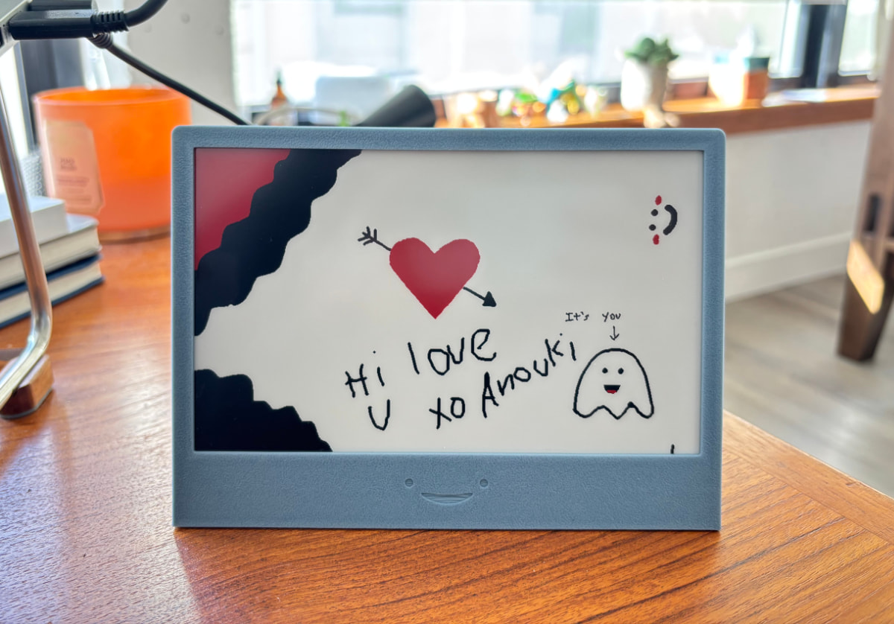

# InkLink
### *Real-time Collaborative E-Paper Canvas*

A collaborative drawing system with a web interface that syncs to an e-paper display.

### Key Features
- Real-time collaborative drawing interface
- Web-based access from any device
- E-paper display sync every 3 minutes
- Multi-user support via WebSocket
- Tri-color display support (black, white, and red)



### Try out the web demo [here](https://inklink.winans.io)

### Read [my blog post](https://nick.winans.io/blog/ink-link/) to get an overview of the project

This project uses a 7.5" tri-color e-paper display to display the drawing from the web interface. The website is real-time and supports multiple concurrent users with websockets. The e-paper display will update every three minutes.

## Hardware Setup
Total cost: ~$45-$85

### Required Components
- Waveshare 7.5 B V3 E-Paper Display (~$30-$50)
  - [Waveshare](https://www.waveshare.com/7.5inch-e-paper-b.htm)
  - [Amazon](https://www.amazon.com/7-5inch-Three-Color-Paper-Like-Displaying-Electricity/dp/B09JSFTGV6)
  - [Aliexpress](https://www.aliexpress.us/item/3256806387212613.html) ([Alternate](https://www.aliexpress.us/item/3256806989536255.html))
  - [Good Display](https://www.good-display.com/product/394.html) ([Store](https://buyepaper.com/products/red-tri-color-e-paper-display-partial-update-gdey075z08))
- Waveshare ESP32 E-Paper Driver Board (~$10-$20)
  - [Waveshare](https://www.waveshare.com/e-paper-esp32-driver-board.htm)
  - [Amazon](https://www.amazon.com/Waveshare-Universal-Driver-Board-ESP32/dp/B07M5CNP3B)
  - [Aliexpress](https://www.aliexpress.us/item/3256807183975806.html)
- 3D printed case front, back, and cover (~$2-$10)
  - [3D files available here](https://github.com/Nicell/InkLink/tree/main/3d-files)
- A micro USB to USB-C adapter (~$5)
  - [Amazon](https://www.amazon.com/Togconn-Adapter-Convert-Connector-Support/dp/B0CDP9JWVY)
- A USB-C cable and a power supply

### Assembly Instructions
1. Print the three case components
2. Place the display in the front
3. Put the back plate on, feed the ribbon cable through the hole
4. Glue the back plate to the front
5. Place the ESP32 on the back plate and hot glue it in place
   - Placement is right above the hole with the headers touching the back plate
   - Test placement with the cover on top before gluing
6. Put the micro USB to USB-C adapter into the microcontroller
7. Place the cover over the microcontroller
8. Glue the cover to the back plate

## Software Setup

### E-Paper Display Setup
1. Install CircuitPython on the ESP32 board:
   - I used the [DOIT ESP32](https://circuitpython.org/board/doit_esp32_devkit_v1/) firmware
   - Follow the [CircuitPython ESP32 Quick Start Guide](https://learn.adafruit.com/circuitpython-with-esp32-quick-start/installing-circuitpython) to get your device on your network and the code editor running

2. Install required CircuitPython libraries:
   - Download the [Adafruit CircuitPython Library Bundle](https://circuitpython.org/libraries) for your version of CircuitPython
   - Install the following libraries to your lib folder with the web file manager:
     - adafruit_connection_manager
     - adafruit_requests

3. Copy the [CircuitPython files](https://github.com/Nicell/InkLink/tree/main/circuitpython) to your device through the web file manager or code editor:
   - `waveshare7in5bv3.py`
   - `draw.py` - Make sure to set the host variable to your server's domain
   - `bmpread.py`

4. Once you're ready to test, edit `code.py` to run `draw.py`
    ```python
    import draw
    ```

### Server Setup

1. Clone the repository:
    ```bash
    git clone <repository-url>
    cd inklink
    ```

2. Deploy using Docker Compose:
    ```bash
    docker compose up -d
    ```

3. (Optional) Set variables:
    - `VITE_WEB_TITLE` - The title of the web interface (build time variable)
    - `CLEAR_CRON` - The cron schedule for clearing the drawing (e.g. `0 6 * * 1` for every Monday at 6am)

4. Update the hostname in `draw.py` to your server's domain

## License

This project is licensed under the MIT License - see the [LICENSE](LICENSE) file for details.
